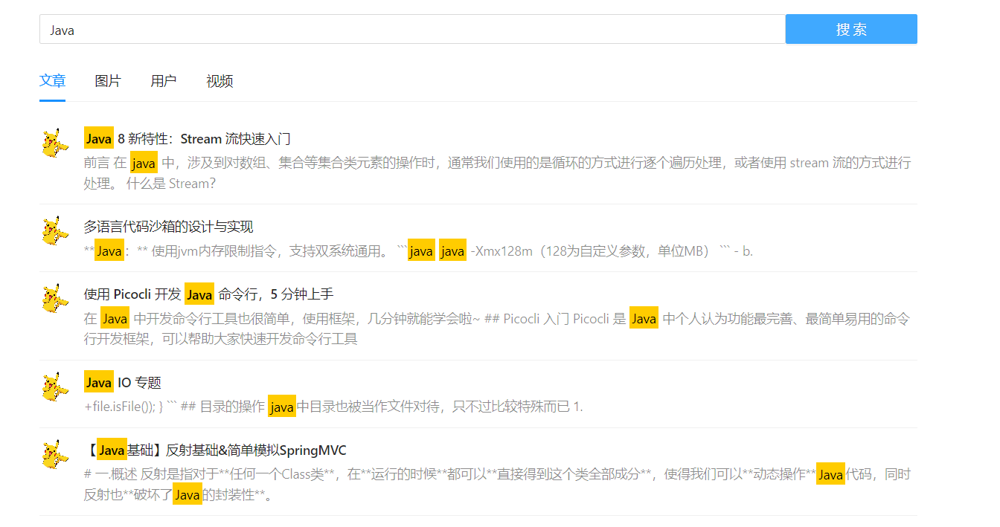
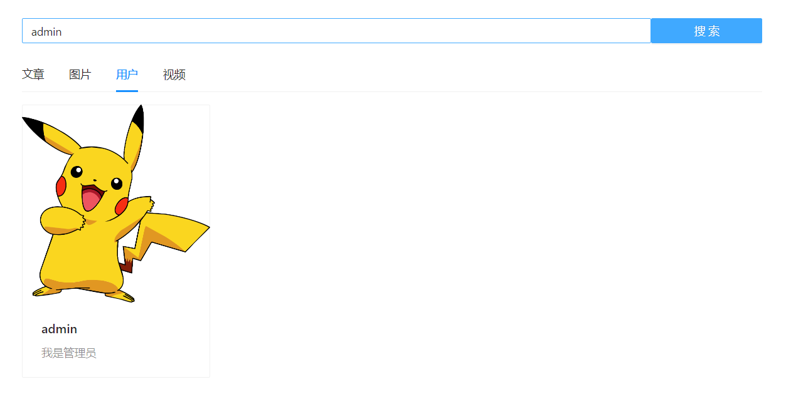
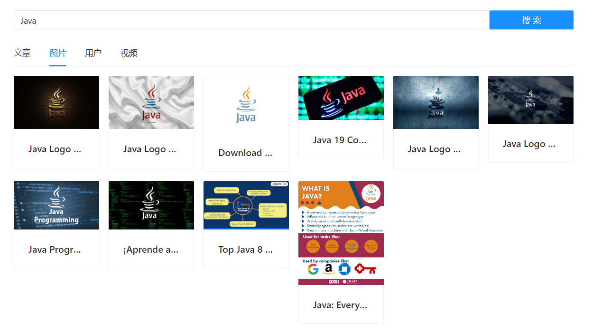
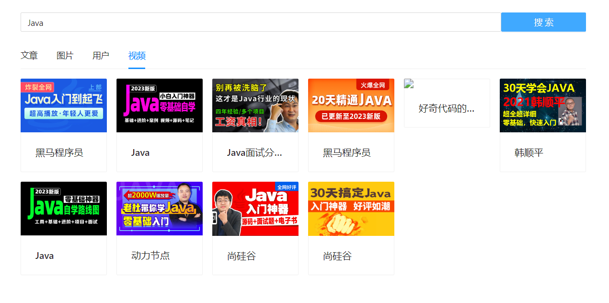
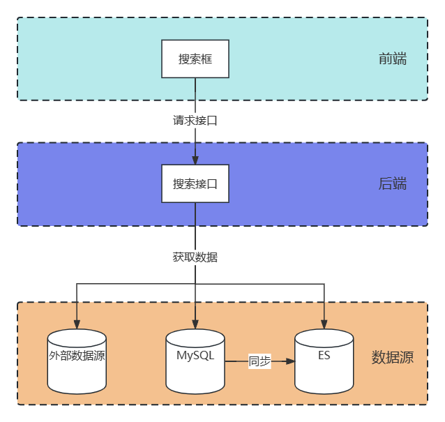

# MultiFind-Hub

> 多源的数据搜索平台

## 💎项目介绍

本项目是一个多源的数据搜索平台。

针对用户而言，只需一次搜索，就可以查询出不同类型（文章、图片、视频等）、不同来源的内容；

针对企业而言，当需要实现搜索功能时，可将本项目作为通用的搜索后端，只需接入相应的数据源即可，无需重复开发，大幅减少开发成本。

## 🚀项目展示

搜文章：搜索框输入有内容提示，搜索结果有关键词匹配的高亮展示



搜用户：



搜图片：



搜视频：



## 🚩系统架构



## 🔧技术选型

### 前端

- 开发框架：Vue
- 组件库：Ant Design Vue
- 打包工具：Webpack

### 后端

- Spring Boot
- MySQL 数据库
- Elastic Stack
  - Elasticsearch 搜索引擎
  - Logstash 数据管道
  - Kibana 可视化看板
- Redis
- SSM
- MyBatis-Plus
- Hutool 工具库

## ✈️快速上手

### 后端

1. 修改配置文件，将 MySQL、Elasticsearch、Redis 的连接信息修改成你本地的
2. 启动 MySQL、Elasticsearch、Redis
3. 启动项目

### 前端

环境要求：Node.js >= 16

安装依赖：

```
yarn
```

项目启动：

```
vue-cli-service serve
```

## 🤝欢迎贡献

对于项目的 bug、细节优化或者其他建议，欢迎在 Issues 区留言